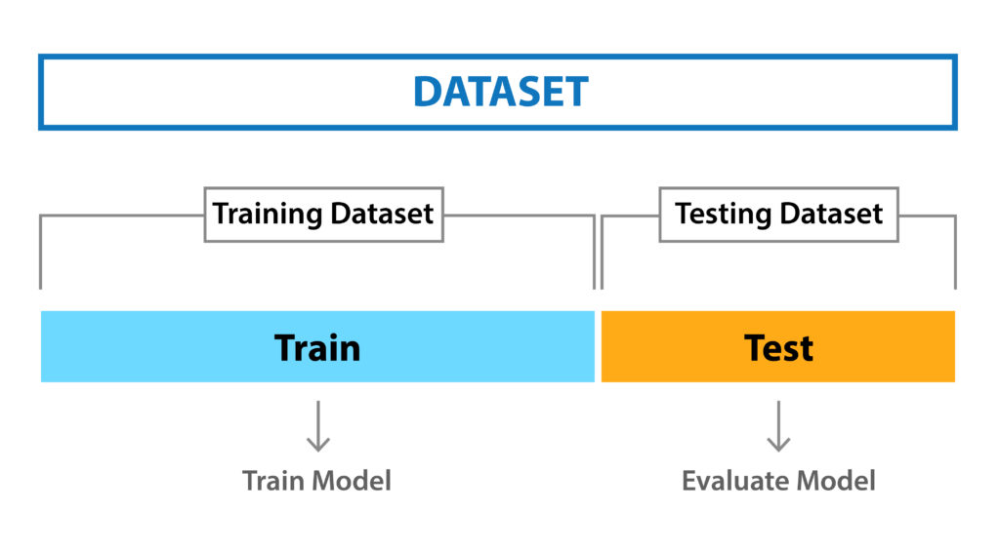
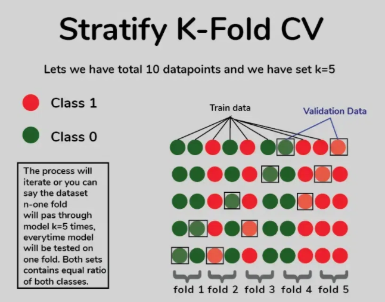
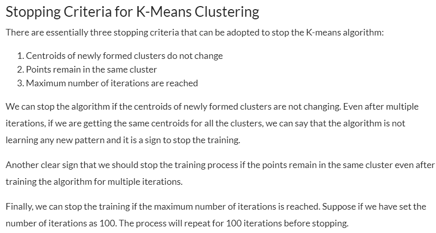
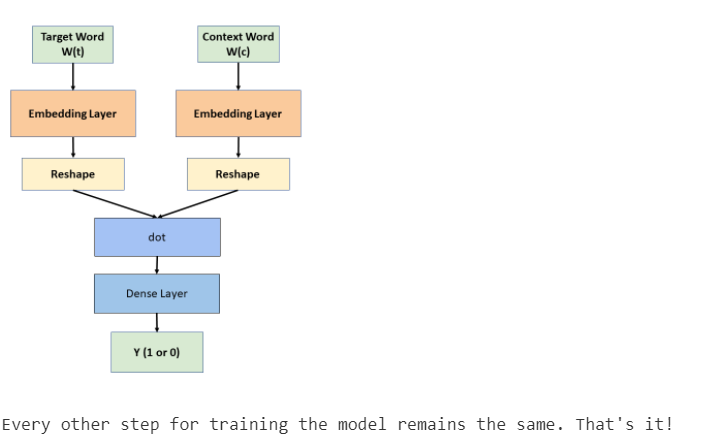
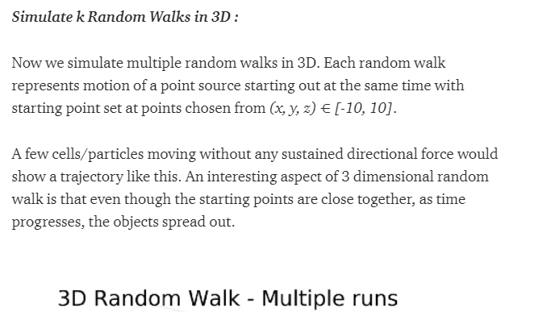

# Machine Learning from scratch
Implementation of machine learning algorithms from scratch

***
The following algorithms are implemented till date:
1. Train Test Split
2. Stratified Split
3. K-Fold Cross Validation
4. Stratified K-Fold Cross Validation
5. Linear Regression
    - With Batch Gradient Descent optimizer
    - With Mini-Batch Gradient Descent optimizer
6. Least Absolute Deviation (LAD) Regression
7. Multiple Linear Regression
8. Logistic Regression
9. Multiple Logistic Regression
10. K Nearest Neighbors
11. K-Means Clustering
12. Plotting Receiver Operating Characteristic (ROC) Curve
13. Word2Vec
    - Implementation in Keras
    - Implementation in PyTorch
15. Random Walk
16. Principal Component Analysis  

# Prerequisites

Supervised Learning
-

Examples of Supervised Learning:

Unsupervised Learning
-

Examples of Unsupervised Learning

Reinforcement Learning
-

scikit-learn algorithm cheat-sheet
-

Train Test Split
-
https://scikit-learn.org/stable/modules/generated/sklearn.model_selection.train_test_split.html

K-Fold Cross Validation
-
https://scikit-learn.org/stable/modules/cross_validation.html

Stratified K-Fold Cross Validation
-
https://scikit-learn.org/stable/modules/generated/sklearn.model_selection.StratifiedKFold.html

Linear Regression 
-
https://towardsdatascience.com/linear-regression-detailed-view-ea73175f6e86

Least Absolute Deviation (LAD) Regression
-
https://www.real-statistics.com/multiple-regression/lad-regression/

Multiple Linear Regression
-
https://towardsdatascience.com/understanding-multiple-regression-249b16bde83e

Logistic Regression
-
https://towardsdatascience.com/logistic-regression-detailed-overview-46c4da4303bc

Multiple Logistic Regression
-
https://sphweb.bumc.bu.edu/otlt/mph-modules/bs/bs704_multivariable/bs704_multivariable8.html

 K Nearest Neighbors
 -
 
 
 
 
 
 K-Means Clustering
 -
 
 
 
 
 
 
 
 
 
 
 
 Plotting Receiver Operating Characteristic (ROC) Curve
 -
 
 
 
 
 
 
 
 Word2Vec
 -
 
 
 
 
 
 
 
 
 
 
 
 Word2Vec Implementation in Keras 
 -
 
 
 
 
 
 
 Word2Vec Implementation in Pytorch
 -
 
 
 
 
 
 
 
 
 
 
 
 
 
 
 
 
 
 
 
 
 
 Random Walk
 -
 
 
 
 
 
 
 
 
 
 
 
 
 
 
 
 
 
 Principal Component Analysis 
 -
 
 
 
 
 
 
 
 
 
 
 
 
 
 
 
 
 
 
 
 
 
 # Hope you've found this helpful, thanks!
 -Kenneth Foo

 
 
 
 

